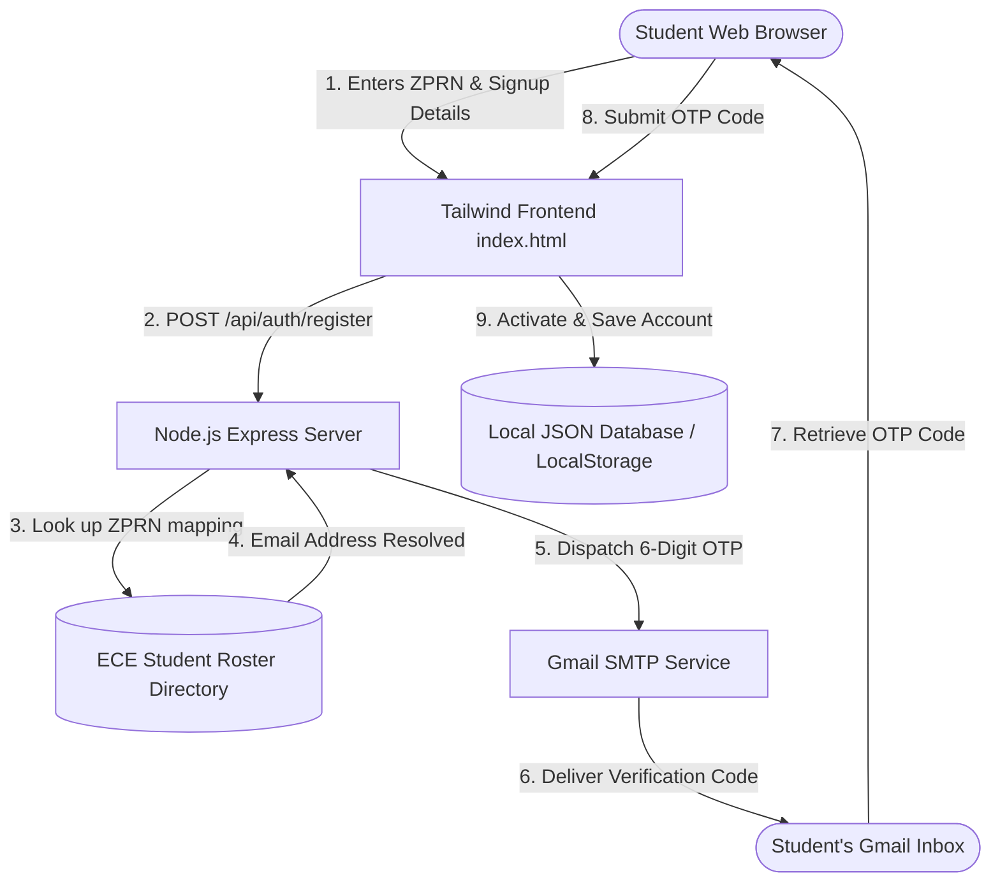

# PROJECT SYNOPSIS
**Department of Electronics and Computer Engineering**
**Zeal College of Engineering & Research, Pune-41**

---

### 1. Project Title
**CampusShare** – Student Resource Sharing & Mutual Exchange Platform

---

### 2. Team Members
| Sr. No. | Name of Student | Roll No. | ZPRN |
|:---:|:---|:---:|:---:|
| 1 | Tejas Kishorkumar Mahajan | N/A | 125UEC1077 |
| 2 | [Partner Name 1] | [Roll No 1] | [ZPRN 1] |
| 3 | [Partner Name 2] | [Roll No 2] | [ZPRN 2] |
| 4 | [Partner Name 3] | [Roll No 3] | [ZPRN 3] |

---

### 3. Domain
Web Application Development, Secure Database Systems & Communication APIs

---

### 4. Introduction
Academic resources (such as textbooks, reference guides, draft instruments, and laboratory equipment) represent a recurring financial burden for students. These resources are often only needed for a single academic term, after which they remain idle. **CampusShare** is a secure, authenticated, peer-to-peer web platform designed specifically for students to list, rent, barter, or donate academic items. 

The application restricts membership to verified campus students by utilizing an automated registration flow. Students register by providing their unique **ZPRN number**, and the backend system automatically cross-references it with the ECE department's student directory to lookup their email address and deliver a 6-digit activation code via Gmail SMTP.

---

### 5. Problem Statement
College students face significant expenses purchasing study materials and gear that they only use temporarily. While informal peer sharing exists, it lacks coordination, visibility, and accountability. Current social media groups are disorganized, prone to spam, and provide no protection against lost, damaged, or unreturned items. 

There is a critical need for a structured campus web portal that:
1. Restricts access strictly to verified ECE department students.
2. Automates verification to protect user security.
3. Provides a rating and "Trust Score" framework to hold students accountable for the items they borrow and return.

---

### 6. Objectives
1. **ZPRN-Based Security**: Create an automated student registration validation that maps ZPRN inputs to database emails and emails verification codes.
2. **Resource Catalog**: Build clean listings interfaces for students to catalog study guides, instruments, or electronic kits for Rent, Sale, or Exchange.
3. **Transaction Tracker**: Model operational states (Request -> Approve -> Handover -> Return) to monitor items.
4. **Trust & Score Metrics**: Implement a dynamic peer rating and Trust Score system (0 to 100) to reward reliable members and moderate bad actors.
5. **Interactive Dashboard**: Build a modern, mobile-responsive layout for student activity feeds, lost-and-found reports, and message threads.

---

### 7. Literature Survey
1. **Manual WhatsApp/Telegram Groups**: Students coordinate sharing through chat groups. *Limitation*: Messages are easily buried, listings are unorganized, and there is no verification system to prevent non-students from joining.
2. **Commercial Rental Websites**: *Limitation*: Heavy transaction fees, no focus on student-to-student sharing, and lacks trust mechanisms suited for a tight-knit campus community.
3. **Static College Web Directories**: Some colleges host static resource pages. *Limitation*: Static text files cannot handle interactive student bookings, transaction tracking, or user accountability.

---

### 8. Proposed System
The proposed **CampusShare** platform is structured around a Node.js Express backend and a responsive Tailwind CSS frontend.

#### Major Features:
- **ZPRN-Verified Registration**: Users register using their ZPRN. The backend resolves their registered email and sends an activation code using Gmail SMTP, eliminating manual email input errors.
- **Mutual Sharing Models**: Support for **Listings**, **Renting** (dates and deposits), and **Exchange** (swapping items).
- **Trust Score & Moderation**: Calculates a rolling trust index for each student profile based on borrow history, return delays, and peer ratings.
- **Lost & Found Channel**: Integrated portal for students to catalog lost or found items on campus, complete with description fields and contact tabs.
- **Responsive Workspace**: Clean dashboard featuring user statistics, top shared items, and active metrics.

---

### 9. System Architecture

---

### 10. Hardware and Software Requirements

#### Hardware Requirements:
| Sr. No. | Hardware | Specification |
|:---:|:---|:---|
| 1 | Development PC | Intel i3/i5 or AMD Ryzen 3/5 Processor, 8GB RAM |
| 2 | Storage | SSD with minimum 10GB free space |
| 3 | Network | Internet connection (for SMTP email dispatch) |

#### Software Requirements:
| Sr. No. | Software / Technology | Version / Details |
|:---:|:---|:---|
| 1 | Operating System | Windows 10 / 11 (64-bit) |
| 2 | Code Editor | **Visual Studio Code (VS Code)** (with AI coding assistance) |
| 3 | Runtime Environment | Node.js v18.0+ & npm |
| 4 | Local Testing Web Server | Apache Server (XAMPP for PHP script verification) |
| 5 | Version Control | Git (Portable Edition v2.45+) |

---

### 11. Technologies / Tools Used
- **Frontend**: HTML5, Tailwind CSS CDN (Responsive layout, custom grid styling, Lucide Icon sets)
- **Backend API Server**: Node.js, Express Framework, CORS middleware
- **Email Delivery Service**: Nodemailer library integrated with secure Google Gmail SMTP
- **Local Databases**: Node JSON file-based database for server environments, LocalStorage API for client-side state simulation
- **Development Tools**: Visual Studio Code (VS Code) + AI Coding Assistant, Git (Version Control), browser developer inspector tools

---

### 12. Expected Outcome
The project will deliver a fully-functioning, secure campus resource sharing web application. ECE students will be able to register using their ZPRN numbers, verify their email accounts, upload resources, request items from peers, and track active transactions. This platform will reduce student expenses, minimize resource waste, and foster a trusted environment on campus.

---

### 13. Scope of the Project
- **Current Scope**: Validating student registration using ZPRN mappings, managing resource catalogs (Rent/Exchange), lost-and-found report listings, and local database transaction routing.
- **Future Scope**:
  - Live chat messaging between borrowers and owners.
  - Push notifications for overdue items.
  - Multi-department integration allowing other campus branches (Mechanical, Civil, IT) to participate.
  - Secure integration of UPI payment APIs for deposit handling.

---

### 14. References
1. *Nodemailer Documentation*, "SMTP Transport configuration guide," https://nodemailer.com/smtp/
2. *Tailwind CSS Documentation*, "Utility-First Fundamentals & Responsive Design," https://tailwindcss.com/docs/
3. *ExpressJS Reference Guide*, "Routing and Middleware Architecture," https://expressjs.com/
4. *Visual Studio Code Reference*, "Managing projects and source control with Git," https://code.visualstudio.com/docs
